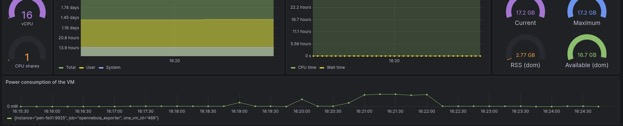
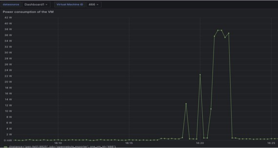

<div align="center">

# VIRTUAL MACHINE ENERGY POWER MONITORING <!-- omit in toc -->

[![Contributors][contributors-shield]][contributors-url]
[![Forks][forks-shield]][forks-url]
[![Stargazers][stars-shield]][stars-url]
[![Issues][issues-shield]][issues-url]
<!-- [![MIT License][license-shield]][license-url] -->

<a href="https://github.com/6G-SANDBOX/power_monitoring">
  
</a>

[![POWER MONITORING][power-monitoring-badge]][power-monitoring-url]

</div>

## 🛠️ Installation Guide

This project enables energy metrics collection on virtual machines using **Scaphandre**, a lightweight agent in C for VM monitoring, and a custom **Grafana dashboard**. Follow the steps below to configure your environment correctly.

---

### ⚙️ Prerequisites

- Ensure the **QEMU guest agent** is running inside each virtual machine (VM).
- OpenNebula Frontends (FE) must be accessible and configured to support custom Prometheus collectors.

---

### 1. Install Scaphandre (on the physical host)

1. Download the latest release of the official **Scaphandre** package from GitHub and install on every OpenNebula Host:  
   👉 [https://github.com/hubblo-org/scaphandre/releases](https://github.com/hubblo-org/scaphandre/releases)

2. Deploy the **systemd service file** for Scaphandre:  
   - You can copy it from a host where Scaphandre is already installed.  
   - If Scaphandre is deployed via Docker, ensure the systemd configuration matches your container setup.

3. Configure the target port:  
   - Add the following environment variable in the host’s configuration:
     ```bash
     #/etc/default/scaphandre
     SCAPHANDRE_PROMETHEUS_PORT=9930
     ```
---

### 2. Deploy the C Agent (inside each VM)

Install the custom VM monitoring agent inside every VM:

1. Clone the repository:
   ```bash
   git clone https://github.com/6G-SANDBOX/power_monitoring
   ```

2. Build and run the agent inside the VM following the instructions provided in the get_proc_ticks folder.

---

### 3. Update OpenNebula Prometheus Collectors (on Frontends)

1. Copy the modified Prometheus collector files to:
   ```bash
   /usr/lib/one/opennebula_exporter
   ```

2. Restart the OpenNebula Prometheus exporter service:
   ```bash
   systemctl restart opennebula-prometheus
   ```

---

### 4. Import Grafana Dashboard

1. Open your **Grafana** instance.
2. Go to the sidebar and click **Dashboards → Import**.
3. Select or paste the contents of the JSON file with the dashboard definition.
4. Choose the appropriate Prometheus data source.
5. Click **Import** to load the dashboard.





## Contributors <!-- omit in toc -->

<a href="https://github.com/6G-SANDBOX/power_monitoring/graphs/contributors">
  
</a>

<!-- Urls, Shields and Badges -->
[power-monitoring-badge]: https://img.shields.io/github/v/release/6G-SANDBOX/power_monitoring?label=POWER%20MONITORING&color=blue
[power-monitoring-url]: https://github.com/6G-SANDBOX/power_monitoring/releases/latest
[contributors-shield]: https://img.shields.io/github/contributors/6G-SANDBOX/power_monitoring.svg?style=for-the-badge
[contributors-url]: https://github.com/6G-SANDBOX/power_monitoring/graphs/contributors
[forks-shield]: https://img.shields.io/github/forks/6G-SANDBOX/power_monitoring.svg?style=for-the-badge
[forks-url]: https://github.com/6G-SANDBOX/power_monitoring/network/members
[stars-shield]: https://img.shields.io/github/stars/6G-SANDBOX/power_monitoring.svg?style=for-the-badge
[stars-url]: https://github.com/6G-SANDBOX/power_monitoring/stargazers
[issues-shield]: https://img.shields.io/github/issues/6G-SANDBOX/power_monitoring.svg?style=for-the-badge
[issues-url]: https://github.com/6G-SANDBOX/power_monitoring/issues
